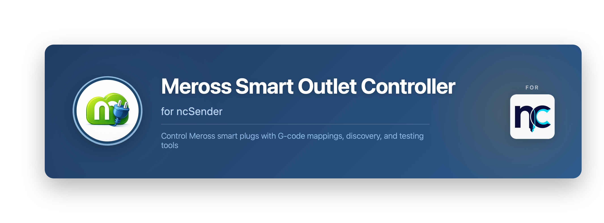
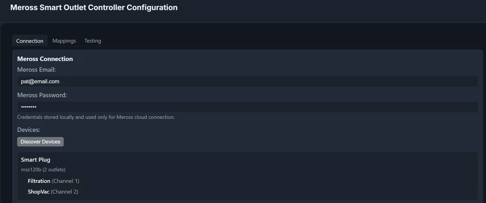
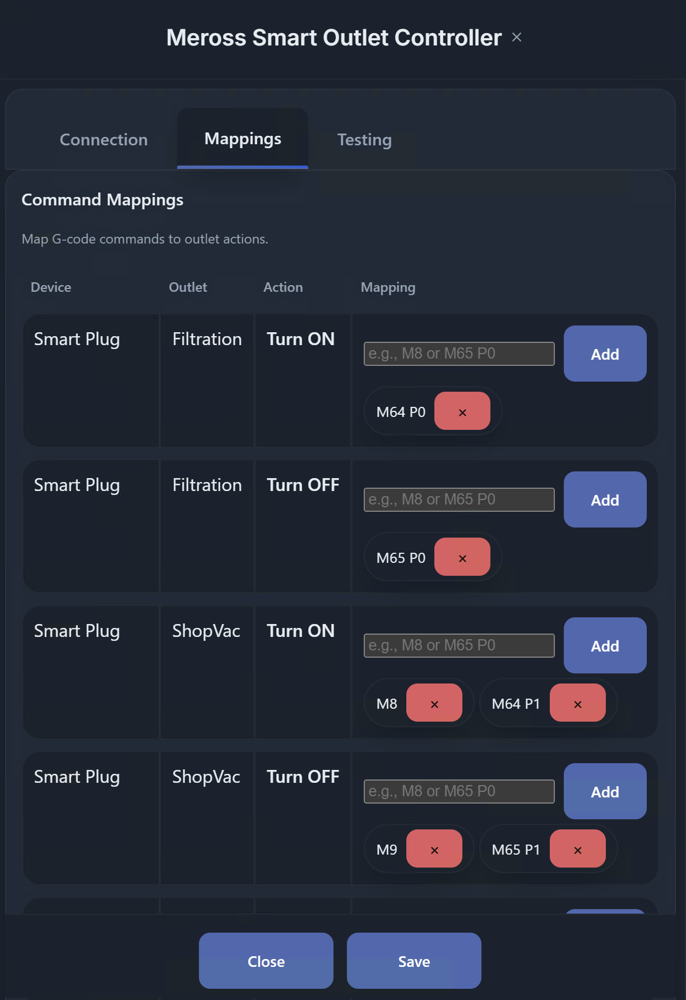
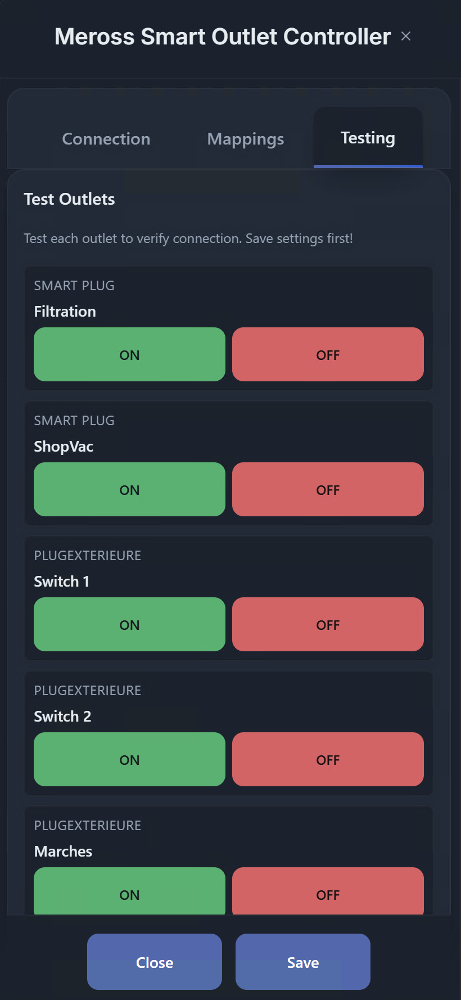

# Meross Smart Outlet Controller for ncSender

A ncSender plugin that controls Meross smart outlets using configurable G-code mappings.

## 🎯 Overview

Ideal for CNC setups where you want M-codes to drive accessories like coolant, dust collection, or lighting attached to a Meross smart outlet. No need for an iot relay!

This plugin lets you:

1. **Discover devices** and outlet names from your Meross account
2. **Map any G-code** to a specific device outlet action
3. **Test outlets** directly from the ncSender UI

## ✨ Key Features

### Device Discovery
- **Account-based discovery**: Lists devices and outlet names from your Meross account
- **Multi-channel aware**: Supports multi-outlet devices with named channels

*Connection settings and discovery*

### Command Mappings
- **Flexible mappings**: Map multiple G-codes to specific device channels
- **Multiple commands per outlet**: Trigger one outlet from several G-code patterns

*Mappings configuration*

### Testing
- **UI testing tools**: Toggle outlets directly from the Testing tab
- **Quick verification**: Validate wiring without running a job

*Outlet testing cards*

## 🚀 Installation

1. **Download** the latest release zip from GitHub Releases
2. **Open ncSender** → Settings → Plugins
3. **Click** "Install Plugin"
4. **Select** the downloaded zip file

The plugin will appear in **Plugins → Meross Smart Outlet Controller**.

## 📖 Quick Start

1. Open **Plugins → Meross Smart Outlet Controller** (tool menu)
2. Enter your Meross email and password
3. Click **Discover Devices**
4. In **Mappings**, add G-codes in the row matching your device/outlet/action
5. Click **Save Settings**
6. Use the **Testing** tab to verify outlets

## ⚙️ Settings

- **Meross Email / Password**: Your Meross account credentials
- **Discover Devices**: Fetches device and outlet names
- **Min Signal Duration**: Debounce time before sending outlet commands
- **Command Mappings**: Table of device/outlet/action rows with G-code lists

## 📊 Technical Details

### Protocols
- **HTTP API**: Login and device discovery
- **MQTT**: Device control (standalone client via Node.js TLS)

### Compatibility
- **ncSender**: 0.3.111+
- **Meross**: Cloud-based devices with MQTT support

---

**Version**: 1.0.0  
**Repository**: https://github.com/cotepat/ncsender-plugin-meross-smart-outlet
